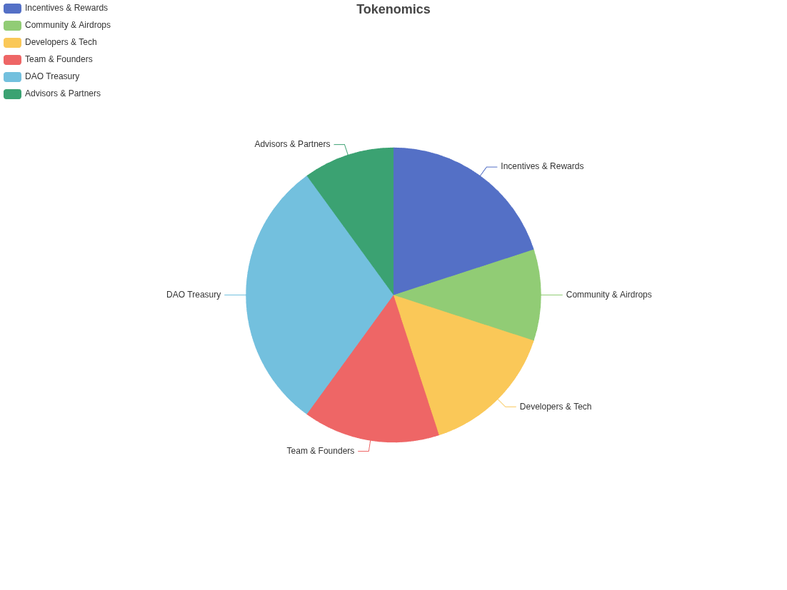

# DAO

Pairfy is a decentralized autonomous organization with a democratic constitutional model.
This means it has a fundamental document containing principles and rules for the proper management of the decentralized organization.

Before the document is established, DAO members debate its content. As a result of this debate, a draft is created and put to a vote.
If the positive votes exceed the 95% threshold, it becomes the DAO's constitutional document.

Any DAO member with voting power > 1 can create a request for:

- **Amendments**: Refer to formal changes made to the constitution, such as the addition, modification, or deletion of provisions.

The Discord channel moderator will initiate a 7-day poll tagging @everyone to determine whether there is interest in further discussing the proposed amendment.
If the majority votes yes, a 7-day debate period will follow.

After the debate, a second 7-day poll will be conducted to let @everyone decide whether the amendment should proceed to an on-chain vote.
::: info
The constitucional document remains on GITHUB for versioning auditing.
:::

| Category              | Percentage | Allocation       | Target                                                              | People |
|-----------------------|------------|------------------|---------------------------------------------------------------------|------- |
| Incentives & Rewards  | 20%        | 200,000,000      | Monthly events and other rewards.                                   |        |
| Community & Airdrops  | 10%        | 100,000,000      | Early community distribution.                                       |        |
| Developers & Tech     | 15%        | 150,000,000      | Allocation for 15 development contributors.                         |   15   |
| Team & Founders       | 15%        | 150,000,000      | Strategic team and founders.                                        |   3    |
| DAO Treasury          | 30%        | 300,000,000      | Protocol governance.                                                |        |
| Advisors & Partners   | 10%        | 100,000,000      | Strategic partners                                                  |        |
| **Total**             | **100%**   | **1,000,000,000**|    

## $Pairfy

The $PAIRFY utility/governance token is used for platform functions and on-chain governance.
Token distribution will take place annually from January 1, 2026 to January 1, 2031.

| Date                | Incentives & Rewards | Community & Airdrops | Developers & Tech | Team & Founders | DAO Treasury | Advisors & Partners | Total Annual     |
|---------------------|----------------------|-----------------------|-------------------|-----------------|--------------|----------------------|------------------|
| 2026 | 33,333,333.33        | 16,666,666.67         | 25,000,000        | 25,000,000      | 50,000,000   | 16,666,666.67        | 166,666,666.7    |
| 2027 | 33,333,333.33        | 16,666,666.67         | 25,000,000        | 25,000,000      | 50,000,000   | 16,666,666.67        | 166,666,666.7    |
| 2028 | 33,333,333.33        | 16,666,666.67         | 25,000,000        | 25,000,000      | 50,000,000   | 16,666,666.67        | 166,666,666.7    |
| 2029 | 33,333,333.33        | 16,666,666.67         | 25,000,000        | 25,000,000      | 50,000,000   | 16,666,666.67        | 166,666,666.7    |
| 2030 | 33,333,333.33        | 16,666,666.67         | 25,000,000        | 25,000,000      | 50,000,000   | 16,666,666.67        | 166,666,666.7    |
| 2031 | 33,333,333.33        | 16,666,666.67         | 25,000,000        | 25,000,000      | 50,000,000   | 16,666,666.67        | 166,666,666.7    |
| **Totales**         | **200,000,000**      | **100,000,000**       | **150,000,000**   | **150,000,000** | **300,000,000** | **100,000,000**     | **1,000,000,000** |
