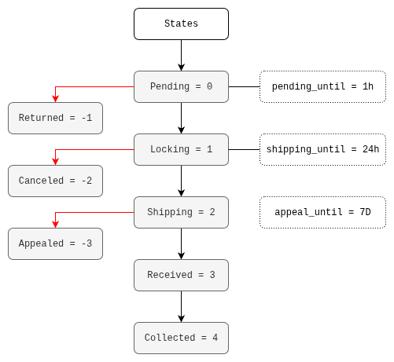

# Architecture

Pairfy is designed to scale horizontally based on user demand.
The web3 architecture is designed to be independent of web2.
This means that the trading logic between buyer and seller is handled by individual smart contracts.
Therefore, if Pairfy's web2 architecture goes down, the most important information is stored on the Cardano/Midnight blockchain.

Trading between buyer and seller works deterministically thanks to a state machine implemented with Plutus V3.
The state machine ensures that one state exists at a time thanks to the threadtoken that is passed from state to state in the contract.

### Pending
The buyer creates the purchase order, which generates a CBOR Tx that is signed and sent from the buyer's browser to the Cardano/Midnight blockchain.
The transaction contains the payment of the order price.

The seller is notified of the purchase order and must accept or ignore it based on payment confirmation after several confirmation blocks on the network.
The seller has a 1 hour deadline to accept.

### Returned 
If the seller doesn't accept the purchase order or ignores it for any reason, the buyer can recover the payment.

### Locking
The seller decides to accept the purchase order within 1 hour, and the contract blocks the funds.
The seller must prepare the package for shipping within 24 hours.

### Canceled
The seller never ships the package, so the trade is terminated and the buyer can recover the funds.

### Shipping
The seller shipped the package within 24 hours. The buyer is notified of the package tracking.

### Appealed
The package never arrived. The product is not the exact one advertised by the seller. The quantity is incorrect. The product is corrupted. Etc.
The appeal status is executed by the buyer and allows for the recovery of funds with the help of a mediator (DAO member).
The appeal may be filed within 7 days after the stipulated delivery date.

### Received
The product is correct. The quantity is exact. The product is not corrupted. The buyer presses the received button.
If they don't press it, the seller won't be able to collect the funds until the 7-day appeal window has passed.

### Collected
The order was not appealed after the 7-day appeal window or the package was received without any problems.
The seller executes the transaction that collects the funds.

