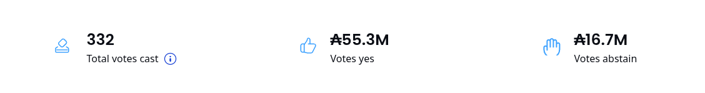

# Introduction

Pairfy is a native Cardano e-commerce dApp for trading physical products, funded by Catalyst Round 11.


Imagine a platform like Amazon, but owned by its buyers and sellers — 
where they can vote on platform decisions, use a common repository of product vendors, marketing templates, and product templates.
It uses the collective intelligence of its DAO members to conduct market and product research for the benefit of the Cardano community.
This makes it easy for any community member to become a seller and generate an ecosystem of value exchange.

The trading process between the seller and the buyer is handled by individual Plutus V3 scripts.
Using a Cardano smart-contract allows to use **_ADA_**, **_stablecoin_** and **_native asset_** as a form of payment for the products.
In addition, the implementation of other innovative and deterministic trading logics. It is also compatible with the **_midnight network._**


#### Differential factors

- Community-governed with chain vote (DAO constitutional model).
- The **discount liquidity pool** to reduce the price of products.
- Use of Cardano Network – Midnight Network 🔥.
- Free shipping is always included.
- ADA Guarantee as purchase protection.
- Each trade is managed by an isolated smart-contract (Important for high horizontal scalability).
- Any member of the community can be a seller (DAO member).
- Community repository of products, suppliers, marketing, landing pages templates.
- Seller incentive program.
- Open-source development (Apache 2.0).
- Integration of AI models.
- Product search by AI vectorized semantics.
- Use of collective intelligence that enables strategic cooperation and mutual benefit for ecosystem members 
(market investigation, supplier analysis, development, innovation, etc).

#### Community-driven open source alternative to

- Amazon
- Shopify
- Dropshipping companies

Pairfy is a open cooperative e-commerce platform where the community itself conducts research and integration of markets, suppliers, and products through its autonomous organization (DAO), allowing it to benefit from collective intelligence and generate an autonomous value-exchange ecosystem.
#### Competitive factors

The most competitive factor is the discount liquidity pool which is fueled by trade fees and ADA generated through staking.
This helps leverage product prices, reducing them by 10% to 25% from traditional market prices.

_Example_

::: tip
Although the price of ADA / USD may fluctuate depending on when this is read the long-term trend is considered bullish. For the purposes of this example the reference value of **1 ADA = 1 USD** will be used.
:::


If the liquidity pool reaches 1.000.000 ADA this liquidity can be
divided by 100 ADA as a form of discount for each buy order.

```md
discount_liquidity = 1_000_000 ADA

order_discount = 100 ADA

discount_liquidity / order_discount = 10_000 discounts

Beneficiaries: 10.000 users
```

This means that 10,000 buy orders will have a discount of 100 ADA.
Which for products over $200 represents a pretty substantial discount. 
A very generous discount is a good incentive to encourage traditional market buyers to migrate to the Cardano ecosystem.


Here's another example with an iPhone:


```md
discount_liquidity = 100_000 ADA

order_discount = 200 ADA

discount_liquidity / order_discount = 2_500 discounts (2.500 Beneficiaries)

Iphone 17 price = 1000USD

Iphone 17 with discount = 800USD
```
#### Technical aspects of the discount pool and the staking pool.

The discount pool grows with the ADA fees contributed by sellers for each sale
and with the ADA rewards generated by the staking pool.
All ADA is sent to the operating wallet which is delegated to the pool itself and allows for generating profits through staking.

In the distribution stage ( airdrop ) the ADA will be transferred to the discount pool, a smart contract with an endpoint that mints the tokens needed to distribute the liquidity for the discounts.
Each token represents an individual discount (1 token = 1 beneficiary).
Tokens are airdropped to the wallets of $PAIRFY holders during the liquidity distribution stage airdrop.

In the user interface during a purchase process. The buyer sees the option to redeem the token as a discount in the right panel.
If the user agrees to do so, they only need to pay the discounted price.

When the buyer makes the purchase, the transaction sends the redeemable token to the individual contract that handles the trade logic.
When the commerce ends, the contract that handles the trade logic sends the redeemable token to the seller who can redeem it for ADA.
The smart contract that manages the discount liquidity uses a state machine and a threadtoken to perform deterministic redemption.

#### Realistic numbers

| Delegation (ADA) | Total Rewards | Operator Margin | Operator Earnings (ADA/year) |
|------------------|----------------|------------------|-------------------------------|
| 10,000,000       | 400,000        | 5%               | 44,759                        |
| 10,000,000       | 400,000        | 10%              | 66,697                        |
| 10,000,000       | 400,000        | 25%              | 122,885                       |
| 10,000,000 ✅    | 400,000        | 50%              | 197,590                       |
| 20,000,000       | 800,000        | 5%               | 63,759                        |
| 20,000,000       | 800,000        | 10%              | 102,697                       |
| 20,000,000       | 800,000        | 25%              | 207,885                       |
| 20,000,000       | 800,000        | 50%              | 387,590                       |
| 30,000,000       | 1,200,000      | 5%               | 83,579                        |
| 30,000,000       | 1,200,000      | 10%              | 138,697                       |
| 30,000,000       | 1,200,000      | 25%              | 292,885                       |
| 30,000,000       | 1,200,000      | 50%              | 577,590                       |
| 40,000,000       | 1,600,000      | 5%               | 103,379                       |
| 40,000,000       | 1,600,000      | 10%              | 174,697                       |
| 40,000,000       | 1,600,000      | 25%              | 377,885                       |
| 40,000,000       | 1,600,000      | 50%              | 767,590                       |
| 50,000,000       | 2,000,000      | 5%               | 123,179                       |
| 50,000,000       | 2,000,000      | 10%              | 210,697                       |
| 50,000,000       | 2,000,000      | 25%              | 462,885                       |
| 50,000,000       | 2,000,000      | 50%              | 957,590                       |


With the goal of staking 10,000,000 ADA consistently for a year, stakers would earn rewards in ADA and $PAIRFY for staking.
This would then generate at least 200,000 ADA annually and 16,666 ADA monthly returned to all holders in the form of a discount.
This is a decent achievement.

In addition, the amount generated by the fee for each sale must be added.
Averaging the fee charged by large private e-commerce companies 10% for each sale of any type of product is a realistic and understandable percentage.
This means that for every $100, $10 is sent to staking.

#### Staking rewards

$PAIRFY utility/governance tokens is distributed as a reward for delegating ADA to staking pools.

#### Paradigm revolution

Using Turing-complete smart contracts enables high levels of innovation that dwarf traditional and centralized applications.
Applications that are currently Web 2 will eventually be replaced by Web 3.
Even large tech companies will have to adapt to this change or else disappear.
The open source community is a giant.
It allows for the distribution of value based on merit and opportunity, enables transparency, and highlights the power of community governance.
Closed source, telemetry, private data collection, will pass.

## Apache License 2.0 Summary

| Category               | Description                                                                                   |
|------------------------|-----------------------------------------------------------------------------------------------|
| ✅ Allowed             | - Use for personal and commercial purposes<br>- Modify the source code<br>- Redistribute original or modified versions<br>- Re-license your modifications<br>- Use in closed-source/proprietary software<br>- Keep changes private (if not redistributed)<br>- Includes a patent grant for added legal protection |
| 📌 Obligations         | - Keep original copyright notices<br>- Include the full Apache 2.0 license<br>- **Indicate if you made changes** (e.g., in file headers, README, or NOTICE)<br>- Include `NOTICE` file if present in the original<br>- Do not imply your version is the original<br>- Do not use trademarks without permission |
| ❌ Restrictions        | - Do not remove or alter license/copyright notices<br>- Do not claim authorship of the original<br>- Do not use logos or names as if they were yours<br>- No liability or warranty: software is provided "as is" |
| 🎯 Ideal For           | - Open source with commercial intent<br>- Integrating into proprietary products<br>- Legal clarity and patent protection<br>- Attribution without copyleft requirements |
